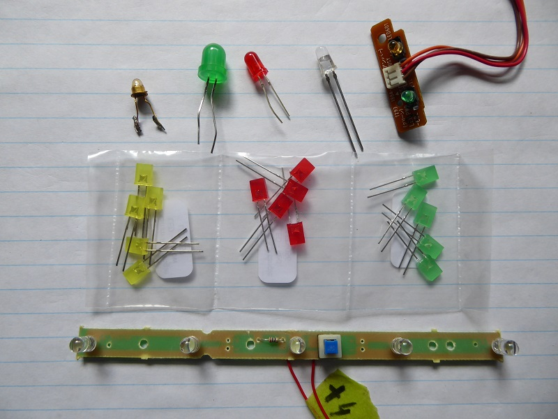
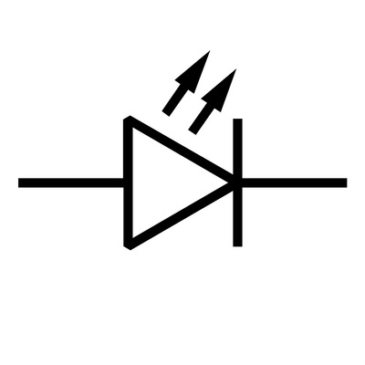
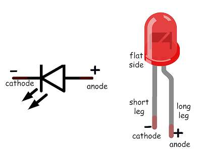

## Some information about light emitting Diodes (LEDs)

To return to the main document at any time click here [BACK](../README.md)

####  Why do we use them?
LEDs are really low power indicator lights, useful to check the your program is working.  Typical microcontrollers can source a few milliamps at 3.3V or 5.0v, and the junction voltage to
turn on an LED is only about 0.6v

####  What do they look like?
LEDs come in a wide range of colours and shapes, a few are illustrated here 

####  All those different LEDs but just one circuit symbol
Here is what you will see in an electronic circuit diagram,
  

LEDs only conduct current in one direction, there are various ways to tell which side should be the positive connection.  
The negative terminal may be marked with a black line,or that side of the LED may be slightly flattened, the positive wire 
is usually longer than the negative one.

####  What happens if you wire a LED in backwards?
NOTHING! LEDs only conduct one way, so accidentally installing one backwards won't hurt, in fact this is another way to find which way it should be connected,

####  Why is there usually a resistor with the LED in a circuit diagram?
Almost every circuit diagram you see looks a bit like this one, with a resistor in series with the LED.

The reason is that LEDs act like a switch once the junction voltage is exceeded, so without the resistor the power supply is essentially shorted to ground!
What happens then is that a large current will flow, drain the battery, burn out the power supply, melt the LED - maybe just one of these, maybe more.
Whatever happens, it will be a **BAD THING**.  So how big a resistor is needed?  Using the Pi Pico as an example, each GPIO pin maximum allowed output 
is 16 milliamps, at 3.3 V.  If we allow for the junction voltage to turn on the LED (0.6 V), then we have 2.7 V which we want to limit to 16 ma.  Using
Ohm's law V/I = R  2.7/0.016 = 168.75 ohms.  Our resistor needs to be at least that value.  You can see that the size of the resistor will depend on both
the voltage supplied and the current capability of the source
